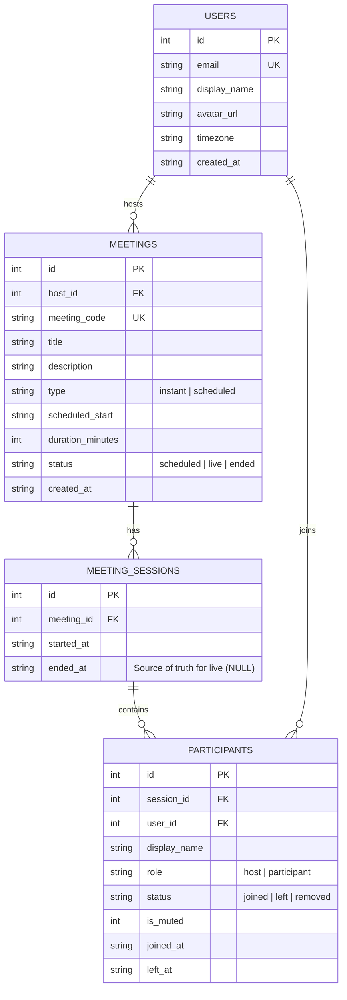

# zoom-clone-scalerAI-assessment

**Author: sanyog-sethi**

A full-stack Zoom web app clone built for the SDE assignment. Designed and implemented to match Zoom's UI/UX, meeting room behaviors, scheduling, and live session rejoin mechanics.

---

## 🚀 Tech Stack

- **Frontend**: Next.js 14 (App Router, TypeScript, Tailwind CSS, Client Components, Lucide Icons)
- **Backend**: Python 3.9+, FastAPI, SQLAlchemy 2.0, Pydantic v2, Uvicorn
- **Database**: SQLite with `PRAGMA foreign_keys = ON`
- **Testing**: pytest & FastAPI TestClient

---

## 📁 Repository Structure

```
zoom-clone-scalerAI-assessment/
├── frontend/
│   ├── src/
│   │   ├── app/
│   │   │   ├── page.tsx               # Dashboard (Action tiles, Clock, Upcoming, Recent)
│   │   │   ├── layout.tsx             # Root layout with fixed Navbar
│   │   │   ├── globals.css            # Custom animations & Tailwind layers
│   │   │   ├── j/[code]/page.tsx      # Direct join by invite link
│   │   │   └── meeting/[code]/page.tsx# Meeting room (Video grid, Control bar, Panel)
│   │   ├── components/
│   │   │   ├── ui/                    # Button, Modal, Input, Avatar, Toast
│   │   │   ├── layout/                # Navbar, Sidebar
│   │   │   ├── dashboard/             # JoinDialog, ScheduleModal
│   │   │   └── meeting/               # VideoGrid, VideoTile, ControlBar, ParticipantsPanel, LeaveMenu
│   │   ├── hooks/                     # useMeetings, useCamera, useParticipants
│   │   └── lib/                       # api.ts (fetch client), format.ts, types.ts
│   ├── tailwind.config.ts             # Zoom design tokens & colors
│   └── package.json                   # Name: zoom-clone-scaleraai-assessment-frontend
├── backend/
│   ├── app/
│   │   ├── main.py                    # FastAPI entrypoint & CORS
│   │   ├── config.py                  # Environment settings
│   │   ├── database.py                # SQLite engine & PRAGMA foreign_keys listener
│   │   ├── dependencies.py            # get_db & get_current_user (User ID 1)
│   │   ├── core/                      # 10-digit meeting code generator & time helpers
│   │   ├── models/                    # SQLAlchemy ORM models (User, Meeting, Session, Participant)
│   │   ├── schemas/                   # Pydantic v2 validation schemas
│   │   ├── repositories/              # SQLAlchemy data access layer
│   │   ├── services/                  # Business logic layer
│   │   └── routers/                   # REST API routes (/api/users, /api/meetings, /api/sessions)
│   ├── scripts/
│   │   └── seed.py                    # Idempotent database seeder
│   ├── tests/                         # Pytest suite (7 passing unit tests)
│   ├── schema.sql                     # Raw SQLite DDL
│   ├── pyproject.toml                 # Name: zoom-clone-scaleraai-assessment-backend
│   └── requirements.txt
├── file_changelog.md                  # Detailed step-by-step file change log
└── README.md
```

---

## 📊 Entity Relationship Diagram (ERD)



---

## ⚙️ Setup & Local Execution

### 1. Backend Setup (FastAPI)

```bash
cd backend

# Create & activate virtual environment
python3 -m venv venv
source venv/bin/activate

# Install dependencies
pip install -r requirements.txt

# Run database seed (creates zoom.db)
python scripts/seed.py

# Run FastAPI server
uvicorn app.main:app --reload --port 8000
```
- API Base URL: `http://localhost:8000/api`
- Interactive Swagger Docs: `http://localhost:8000/docs`

### 2. Frontend Setup (Next.js)

```bash
cd frontend

# Install dependencies
npm install

# Run dev server
npm run dev
```
- Web Application URL: `http://localhost:3000`

---

## 🛠️ Environment Variables

### Backend (`backend/.env`)
```env
FRONTEND_URL=http://localhost:3000
DATABASE_URL=sqlite:///./zoom.db
```

### Frontend (`frontend/.env.local`)
```env
NEXT_PUBLIC_API_URL=http://localhost:8000/api
```

---

## 🧪 Running Backend Unit Tests

```bash
cd backend
./venv/bin/python -m pytest
```
Covers 10-digit meeting code uniqueness, join validation (404 / 409 / 403), recent session rejoin eligibility, and upcoming query filters.

---

## 💡 Key Design Decisions

1. **Meeting vs Session Split**:
   - `meetings` records scheduled/instant metadata, while `meeting_sessions` tracks individual live occurrences.
   - `meeting_sessions.ended_at IS NULL` is the **single source of truth** for whether a meeting session is currently live.
2. **Transaction Safety**:
   - Updates to `meeting_sessions.ended_at` and `meetings.status` are executed within a single database transaction (`db.commit()`), preventing inconsistent intermediate states.
3. **Derived Invite Links**:
   - Invite links follow `{FRONTEND_URL}/j/{meeting_code}` and are derived dynamically in the UI rather than stored in the database.
4. **Soft-State Participant History**:
   - Every join creates a new row in `participants`, preserving a history of stays per user and tracking accurate join/leave timestamps.
5. **Rejoin Mechanics**:
   - Rejoining a live session reuses the display name from the user's previous stay and skips the name prompt.
   - If the meeting ended in the meantime, the server responds with `409 Conflict`, and the UI notifies the user that the meeting has ended.
6. **No Auth Assumption**:
   - `get_current_user` dependency automatically resolves to default seeded User ID 1 (`Sanyog Sethi`). Other users exist in seed data to populate participant history.
