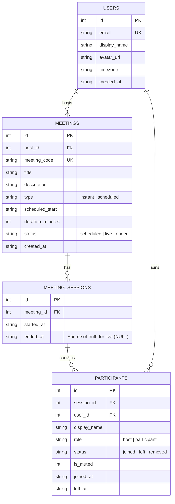

# Zoom Clone - Scaler AI Assessment

A full-stack, production-grade Zoom web application clone built for the Scaler AI SDE assessment. Designed and implemented to replicate Zoom Workplace's desktop UI/UX, meeting room behaviors, audio/video streaming, scheduling, participant controls, and authentication.

---

## 🚀 Tech Stack

### Frontend
- **Framework**: Next.js 14 (App Router, Client Components, TypeScript)
- **Styling & UI**: Tailwind CSS (Custom Zoom Dark Mode design tokens, animations, custom scrollbars)
- **Icons**: Lucide React
- **Real-Time Video/Audio**: WebRTC (`RTCPeerConnection`, Web Audio API synthetic tracks, Perfect Negotiation pattern with glare handling)
- **Signaling Relay**: Dual engine (Local `BroadcastChannel` for same-browser tabs + HTTP Polling Relay for cross-profile / cross-device peers)

### Backend
- **Framework**: Python 3.9+, FastAPI, Uvicorn
- **Database**: SQLite 3 with SQLAlchemy 2.0 ORM & `PRAGMA foreign_keys = ON`
- **Security & Auth**: Bcrypt password hashing, PyJWT authentication tokens, Google OAuth token verification fallback, Header-based user context fallback
- **Validation & Schemas**: Pydantic v2
- **Testing**: `pytest` with FastAPI `TestClient` (15 passing unit tests)

---

## 📁 Repository Structure

```
zoom-clone-scalerAI-assessment/
├── frontend/
│   ├── src/
│   │   ├── app/
│   │   │   ├── page.tsx               # Dashboard (Action tiles, Clock, Upcoming, Recent)
│   │   │   ├── layout.tsx             # Root layout with fixed Navbar
│   │   │   ├── globals.css            # Custom animations & Tailwind layers
│   │   │   ├── j/[code]/page.tsx      # Direct join by invite link
│   │   │   └── meeting/[code]/page.tsx# Meeting room (Video grid, Control bar, Panel)
│   │   ├── components/
│   │   │   ├── ui/                    # Button, Modal, Input, Avatar, Toast
│   │   │   ├── layout/                # Navbar, Sidebar
│   │   │   ├── dashboard/             # JoinDialog, ScheduleModal
│   │   │   └── meeting/               # VideoGrid, VideoTile, ControlBar, ParticipantsPanel, LeaveMenu
│   │   ├── hooks/                     # useMeetings, useCamera, useParticipants
│   │   └── lib/                       # api.ts (fetch client), format.ts, types.ts
│   ├── tailwind.config.ts             # Zoom design tokens & colors
│   └── package.json                   # Name: zoom-clone-scaleraai-assessment-frontend
├── backend/
│   ├── app/
│   │   ├── main.py                    # FastAPI entrypoint & CORS
│   │   ├── config.py                  # Environment settings
│   │   ├── database.py                # SQLite engine & PRAGMA foreign_keys listener
│   │   ├── dependencies.py            # get_db & get_current_user (User ID 1)
│   │   ├── core/                      # 10-digit meeting code generator & time helpers
│   │   ├── models/                    # SQLAlchemy ORM models (User, Meeting, Session, Participant)
│   │   ├── schemas/                   # Pydantic v2 validation schemas
│   │   ├── repositories/              # SQLAlchemy data access layer
│   │   ├── services/                  # Business logic layer
│   │   └── routers/                   # REST API routes (/api/users, /api/meetings, /api/sessions)
│   ├── scripts/
│   │   └── seed.py                    # Idempotent database seeder
│   ├── tests/                         # Pytest suite (7 passing unit tests)
│   ├── schema.sql                     # Raw SQLite DDL
│   ├── pyproject.toml                 # Name: zoom-clone-scaleraai-assessment-backend
│   └── requirements.txt
├── file_changelog.md                  # Detailed step-by-step file change log
└── README.md
```

---

## 📊 Entity Relationship Diagram (ERD)



### Database Schema (DBML Format for [dbdiagram.io](https://dbdiagram.io))

```dbml
// Zoom Clone Database Schema

Table users {
  id integer [pk, increment]
  email varchar [unique, not null]
  password_hash text [note: 'Bcrypt hashed password']
  display_name varchar [not null]
  avatar_url text
  timezone varchar [default: 'UTC']
  created_at varchar [not null, note: 'ISO-8601 UTC']
}

Table meetings {
  id integer [pk, increment]
  host_id integer [not null, ref: > users.id]
  meeting_code varchar [unique, not null, note: '10-digit unique code']
  title varchar [not null]
  description text
  type varchar [not null, note: 'instant or scheduled']
  scheduled_start varchar [note: 'ISO-8601 UTC start time']
  duration_minutes integer
  status varchar [not null, default: 'scheduled', note: 'scheduled, live, or ended']
  created_at varchar [not null]
}

Table meeting_sessions {
  id integer [pk, increment]
  meeting_id integer [not null, ref: > meetings.id]
  started_at varchar [not null]
  ended_at varchar [note: 'NULL indicates live active session']
}

Table participants {
  id integer [pk, increment]
  session_id integer [not null, ref: > meeting_sessions.id]
  user_id integer [not null, ref: > users.id]
  display_name varchar [not null]
  role varchar [not null, note: 'host or participant']
  status varchar [not null, note: 'joined, left, or removed']
  is_muted integer [default: 0, note: '0 = unmuted, 1 = muted by host']
  joined_at varchar [not null]
  left_at varchar
}
```

---

## 💻 Setup & Local Execution

### Prerequisites
- Node.js v18+ and `npm`
- Python 3.9+ and `pip`

### 1. Backend Setup (FastAPI)

```bash
cd backend

# 1. Create and activate a Python virtual environment
python3 -m venv venv
source venv/bin/activate

# 2. Install backend dependencies
pip install -r requirements.txt

# 3. Seed the database with initial users and scheduled meetings
python scripts/seed.py

# 4. Start the FastAPI development server
uvicorn app.main:app --reload --port 8000
```
- **API Base URL**: `http://localhost:8000/api`
- **Interactive OpenAPI / Swagger Docs**: `http://localhost:8000/docs`

### 2. Frontend Setup (Next.js)

```bash
cd frontend

# 1. Install frontend dependencies
npm install

# 2. Start the Next.js development server
npm run dev
```
- **Web Application URL**: `http://localhost:3000`

---

## ⚙️ Environment Variables

### Backend (`backend/.env`)
```env
FRONTEND_URL=http://localhost:3000
DATABASE_URL=sqlite:///./zoom.db
JWT_SECRET=supersecretjwtkey_change_in_production
```

### Frontend (`frontend/.env.local`)
```env
NEXT_PUBLIC_API_URL=http://localhost:8000/api
```

---

## 🧪 Running Unit Tests & Type Checking

### Backend Unit Tests (Pytest)
```bash
cd backend
PYTHONPATH=. ./venv/bin/pytest
```
- **Coverage**: 15 unit tests covering auth registration/login, 10-digit meeting code generation, scheduled meeting start validation, host mute-all persistence, WebRTC signaling relay, participant removal, and recent session rejoin.

### Frontend Type Checking (TypeScript)
```bash
cd frontend
npx tsc --noEmit
```

---

## 📌 Key Architectural Assumptions

1. **Meeting vs Session Separation**:
   - `meetings` tracks the scheduled or instant meeting definition (10-digit code, title, schedule).
   - `meeting_sessions` tracks individual live meeting executions. `ended_at IS NULL` is the single source of truth for an active live meeting session.

2. **Scheduled Meeting Start Rules**:
   - Non-host participants cannot join a scheduled meeting before it has been started by the host or before its scheduled start time. If the users still attempt to join, the server throws a '400 Bad Request' error specifying the user that "This scheduled meeting has not started yet".
   - Hosts can start scheduled meetings from the dashboard or by joining, creating the active `meeting_sessions` record and converting the status of meeting to `live`.
   - Hosts get an option to start the meeting early as well. Starting from 15 minutes before the scheduled time of the meeting, the host gets a Start button under the scheduled meeting through which they can start the meeting earlier if wanted.
   - Schedule Meeting modal automatically sets the default start time to the next 15-minute time slot relative to current local time (e.g. 5:06 AM -> 5:15 AM).

3. **WebRTC Real-Time Video & Audio Architecture**:
   - The live streaming funcionality is built with WebRTC `RTCPeerConnection` supporting live multi-party camera video and audio.
   - Dual signaling engine combines same-browser tab `BroadcastChannel` with backend HTTP signaling relay polling endpoints (`/api/signaling/send` & `/api/signaling/poll`), enabling WebRTC connections across different browser profiles(for testing purposes), incognito windows, and distinct network clients.

4. **Participant Audio & Mute Synchronization**:
   - Host `Mute All` functionality- mutes participant's mic input and sets `is_muted = 1` in the backend database.
   - Muted status persists across participant polling ticks. When a participant clicks **Unmute**, their client unmutes in a single click, updating `is_muted = 0` without state-rollback race conditions.

5. **Session Termination & Removal**:
   - When the host clicks **End Meeting for All**, a `meeting_ended` signal is broadcast via WebRTC signaling relay, closing all connected peer connections, releasing local media hardware, clearing session storage, and redirecting all participants back to the dashboard.
   - Navigating away from the meeting room page triggers `sendBeacon` / `keepalive` cleanup to set participant status to `left` and enable rejoin under Recent Sessions on the dashboard.

6. **Authentication & Profile Context**:
   - Implements JWT authentication alongside Bcrypt password hashing.
   - Includes a dev **Profile Switcher** in the top navigation header to allow instant switching between host and participant personas for multi-user testing in a single browser instance.

7. **Zoom Branding Alignment**:
   - Uses Zoom signature blue (`#0B5CFF`) avatars with bold uppercase white initials, dark theme design tokens (`#1A1A1A`, `#242424`), fixed Workplace navigation bar, calendar popovers, and interactive three-dots scheduled meeting menus (**Copy Meeting ID** and **Copy Invite Link**).

